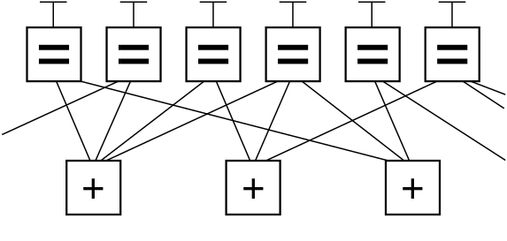
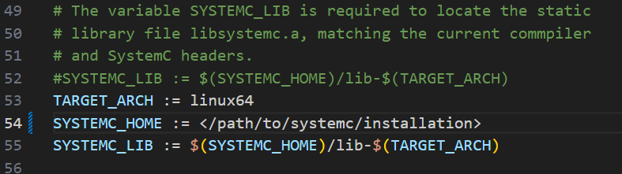

# NB-LDPC Code Decoder Simulator User Guide
Author: Eric Reiss

## Introduction

The purpose of this project is to provide a framework for developing and testing non-binary low-density parity-check (NB-LDPC) code decoding algorithms. This guide provides the information necessary to set up a project, implement a decoding algorithm, and obtain the results. To successfully use this tool, the user should have a working knowledge of communication theory, NB-LDPC codes, and C++.

The sections discussed in this guide are:

- [Tool Description](#tool-description)
- [Required Equipment and Software](#required-equipment-and-software)
- [Safety Considerations](#safety-considerations)
- [Directions](#directions)
- [Troubleshooting](#troubleshooting)
- [Conclusion](#conclusion)

## Tool Description

This tool is implemented using SystemC, which is an extension of C++. Building the tool is handled by the CMake toolchain. The repository is organized by directories containing the files necessary to build and simulate a decoder. The directories included are codes, inc, opt, and src. A description of each is included below. The simulator comes with an implementation of the Belief Propagtion algorithm, which is commonly used for binary LDPC code decoders.

### SystemC

SystemC is a library that extends C++ and adds hardware simulation capabilities. Classes in SystemC are analagous to modules or entities in Verilog or VHDL, respectively. Each class defines input and output ports and instantiates lower level classes within it. Theses instantiated classes are connected, similar to an HDL. Each class defines a behavior function and sensitivity list. At the edge of a sensitive signal, the behavior function is called. This is analagous to an always block or process in Verilog or VHDL, respectively.

### Belief Propagation For LDPC Codes

The purpose of this section is to provide a description of the algorithm currently implemented by the tool. This software is designed to be a tool for prototyping and simulating NB-LDPC Decoding algorithms. The tool comes with an example implmentation of the Belief Propgation algorithm. This implementation is loosely based on the modified Belief Propagation algorithm provided by Davey and MacKay in their 1998 paper "Low-Density Parity-Check Codes Over GF(q)". A brief description of the algorithm is descibed below.

The Belief Propagation algorithm is commonly used across a variety of applications where the process can be modeled by a graph. Typically the algorithm involves passing messages between the nodes in the graph, and so it is often commonly referred to as a message-passing algorithm. When applied to LDPC codes (either binary or non-binary) the parity check matrix of the code can be interpreted as a Tanner Graph (see Figure 1) consisting of symbol nodes and check nodes.

<figure>
    
    <figcaption>Figure 1. Tanner graph representation</figcaption>
</figure>

For binary LDPC codes the belief propagation algorithm iteratively decodes a signal by initializing the symbol nodes to the either the received bit or the quantized value of the symbol. Theses received symbols are then passed as messages to the check nodes where the parity check is calculated. The actual parity check calculation depends on whether hard or soft symbols are used. The check node receives these messages on all edges except one, which becomes outgoing edge. In other words, the check nodes calculates the parity check for symbol node X using messages passed by all adjacent symbol nodes except for symbol node X. This process is iteratively repeated until parity checks are satisfied or a maximum iteration count is reached.

The non-binary version of the algorithm makes use of the same Tanner graph structure; however, the messages passed are vectors containing the probability that a given symbol is each element of the Galois Field used. The check node then takes the vectors of each adjacent symbol node and, for each element of the Galois Field, calculates the probability for that element by multiplying and accumulating the valid combinations of that element. The symbol nodes then make a decision based on the most likely element. Decoding is complete when the vector of decisions $z$ multiplied by the parity-check matrix, $H$, results in the zero-element of the Galois Field.

The final difference to account for is the non-zero elements of $H$. In binary LDPC codes, non-zero elements of the parity-check matrix are always 1, but for NB-LDPC codes, the non-zero elements of the parity-check matrix can be any element in the Galois Field. The effect of the non-binary elements is a permutation of the probability vectors that are passed.

### Directories

The purpose of this subsection is provide a description of the organization of the repository.

#### NB-LDPC

This is the top level directory of the the project and contains the files needed to start the build process with the CMake toolchain. The important files are described below.

- **COPYRIGHT** This file contains the copyright for this software.
- **Makefile** The Makefile is the script that starts the CMake tool chain and builds the project.
- **systemc.mk** This file contains configuration details specific to SystemC
- **README.md** The README contains this document in Markdown.

#### codes

The codes directory contains the alist files of common LDPC matrices. The alist format was developed by David Mackay as a way to efficently sparse matrices. More information can be found on David Mackay's website ([link](https://www.inference.org.uk/mackay/codes/alist.html)). The codes directory contains alist files for the binary 802.11n and PegReg codes as well alist files for GF(4) and GF(8) NB-LDPC codes. The alist files provided by David Mackays website ([code file downloads](https://www.inference.org.uk/mackay/codes/))

#### inc

The inc folder contains the header files used in the simulation. The header files contain most of the code that is specific to a decoder implementation. The following files are included with the repository.

- **alist.h** Header file that defines the functions used to process the alist file
- **decoder.h** Header file that defines the decoder module
- **LDPC_testbench.h** Header file that tefines the testbench module
- **ldpcsim.h** Header file for the top level SystemC file, this is not a module
- **nodes.h** Header file that defines the symbol node and check node modules
- **nrutil.h** Header file containing numerical methods
- **r.h** Header file that defines useful helper functions, written by David Mackay
- **rand.h** Header file that defines randomization constants and methods, written by David Mackay
- **sc_vector.h** SystemC library header file that allows vector inputs and outputs
- **sc_vector.ipp** Optimized implementatoin of sc_vector methods

#### src

The src folder contains all the source cpp files that are compiled by the build tool. The SystemC source files define all the module connections and generate the inputs. The following files are included in the src folder.

- **alist.cpp** Processes the alist files and creates the code struct
- **ldpcsim.cpp** Top level SystemC file that instantiates the testbench and decoder modules
- **nrutil.cpp** File provided by David Mackay with useful helper functions
- **r.cpp** File provided by David Mackay that contains randomization functions


## Required Equipment and Software

To effectively use this tool, the following hardware is required:

- Computer with at least 8GB RAM

The following software is required:

- Linux OS 64-bit
- GNU Make v4.3 or later
- GNU Compiler v11.4.0 or later
- Git v2.34.1 or later
- CMake v3.22.1 or later ([CMake Website](https://cmake.org/download/))
- SystemC v3.0.0 or later ([SystemC GitHub page](https://github.com/accellera-official/systemc/blob/main/INSTALL.md))
- IT++ Library v4.3.0 or later ([IT++ Website](https://itpp.sourceforge.net/4.3.1/))

## Safety Considerations


This tool is provided as-is. SystemC is an extension of C++, and as such, is not intrinsically memory-safe. Any changes made to the tool are done at the operator's own risk.

## Directions

The following steps describes the steps necessary to install and run the simulator.

1. Install system depencies

Use your Linux's package manager to install GNU Make, GNU compiler, Git, and CMake. Below is an example of installing these libraries on Ubuntu.

```bash
sudo apt install make
sudo apt install git
sudo apt install gcc
sudo apt install cmake
```

2. Install SystemC

The easiest way to install SystemC is to clone the public git repository, and then follow the instructions found on the official SystemC README ([link](https://github.com/accellera-official/systemc/blob/main/INSTALL.md)). The command to clone the repository is

```bash
git clone git@github.com:accellera-official/systemc.git
```

3. Install IT++

The IT++ library is hosted on SourceForge. The repository can be cloned with the following command.

```bash
git clone git://git.code.sf.net/p/itpp/git itpp-git
```

Once cloned, the installation instructions are found at this [link](https://itpp.sourceforge.net/4.3.1/installation.html)

4. Build the project

The tool comes with a MakeFile to handle the compiling, linking, and building of the project. The system variable SYSTEMC_HOME needs to be set to the path of the SystemC installation.

<figure>
    
    <figcaption>Figure 2. SYSTEMC_HOME example</figcaption>
</figure>

5. Run the simulator

If the make command is successful then a '.x' file will be generated with the name of the module that is set in the Makefile. There are several command line arguments that are required to run the simulator.

ALIST - Path to alist file containing parity check matrix

DATA - Path to data file

RATE - Code rate

SNR - Signal to noise ratio

ITERATIONS - Maximum number of iterations

INTERVAL - Number of iterations between incremental progress reports

YMAX - Maximum quantization value

LOGFILE - Incremental report file

BITS - Bits per symbol

Below is an example script that runs the simulator with the PEGReg504x1008 binary LDPC code.

```bash
#!/bin/bash

export LD_LIBRARY_PATH=</path/to/SystemC/library>/lib-linux64:$LD_LIBRARY_PATH
export LD_LIBRARY_PATH=</path/to/it++/library>/lib:$LD_LIBRARY_PATH

ALIST=codes/PegReg/PEGReg504x1008.alist
DATA=codes/PegReg/data.enc
RATE=0.5
SNR=4.0
ITERATIONS=1000
INTERVAL=400
YMAX=3
LOGFILE=example.log
BITS=4

./nbldpcsim.x $ALIST $DATA $RATE $SNR $ITERATIONS $INTERVAL $BITS $YMAX $LOGFILE
```
## Troubleshooting

Most of the issues with the simulator arise from linking errors with the either SystemC libraries or the IT++ libraries. In either case, a useful troubleshooting tool is the pkg-config tool.

```bash
sudo apt intall pkg-config
```

The pkg-config tool can be used to generate the necessary GCC flags to link the libraries. In both the IT++ and SystemC libraries there is a pkgconfig folder containing the files used to generate the flags. The pkg-config tool searches the /usr/lib/pkgconfig and /usr/share/pkgconfig folders by default. Any additional search paths need to specified with the system variable PKG_CONFIG_PATH. Below is an example of using the pkg-config library to generate the flags for the IT++ library.

```bash
PKG_CONFIG_PATH=</path/to/IT++>/lib/pkg-config
pkg-config --exists itpp # Check that the right directory was added
echo $? # Prints 1 if found
pkg-config --libs itpp
```


## Conclusion

If all these steps are followed then the end product should be a functioning NB-LDPC code decoder simulator. Thank you for taking the time to use this tool.